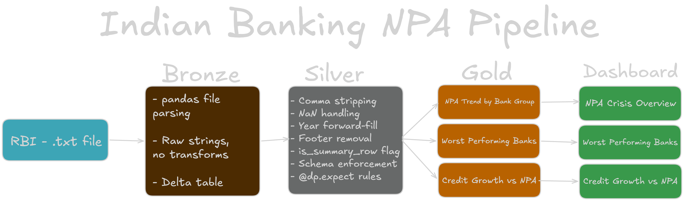

# Indian Banking NPA Pipeline

I built this project to get hands-on with Databricks and real messy data. It's a batch pipeline that processes 21 years of RBI data on Non-Performing Assets (NPA) across Indian banks — public sector, private sector, foreign, and small finance banks from 2004 to 2025.

The data comes directly from RBI's website and is genuinely messy — merged cells, footer notes, Indian number formatting, summary rows mixed with bank-level data. Working through all of that was the most interesting part.

---

## What I Used

- Databricks Free Edition
- Spark Declarative Pipelines (`pyspark.pipelines`) — the updated version of Delta Live Tables
- PySpark + Pandas
- Unity Catalog and Delta Lake
- Databricks AI/BI Dashboard for visualisation

---

## Architecture



Standard Medallion architecture — Bronze lands raw data, Silver cleans it, Gold builds analytics tables.

---

## Data Source

**RBI DBIE — Bank-wise Gross NPA, Gross Advances, NPA Ratio (2004–2025)**  
Source: [data.rbi.org.in](https://data.rbi.org.in)

Three columns per bank per year — Gross NPA (absolute bad loan amount in crores), Gross Advances (total loans disbursed), and NPA Ratio (percentage of loans gone bad). 200+ banks across 21 years.

---

## Pipeline

```
src/
├── 01_bronze_ingestion.py       — reads raw file, lands as-is
├── 02_silver_transformation.py  — cleaning, casting, data quality
└── 03_gold_analytics.py         — three analytics tables
```

---

## What Each Layer Does

### Bronze

Just reads the raw `.txt` file and lands it as strings. No transformations at all — that's intentional. Bronze should be a faithful copy of the source.

I used pandas to read the file because the raw RBI file is a tab-separated text file with inconsistent structure and PySpark's file readers don't handle that well. Pandas gives you more control over how to parse messy files. Once it's in a DataFrame I convert it to Spark.

---

### Silver

This is where most of the work happens. The raw data had several issues I had to work through:

**Indian comma formatting** — numbers like `1,12,023.37` (Indian lakh/crore system) can't be cast to double directly. Spark silently returns null instead of throwing an error, which meant major banks like SBI and HDFC were showing up as null for gross_npa and gross_advances. I only caught this when I noticed the null count seemed too high. Fixed with `regexp_replace` to strip commas before casting.

**NaN strings** — the raw file uses `"NaN"` as a placeholder for missing values. Spark treats this as a valid IEEE float (`Double.NaN`) rather than null, which then fails SQL range checks. Had to explicitly replace `"NaN"` strings with `None` before casting.

**Year forward-fill** — the source file uses merged cells for the year column so only the first row of each year has the year value, the rest are blank. Used a Window function with `last(ignorenulls=True)` to fill forward. Needed `monotonically_increasing_id()` to preserve row order since Spark DataFrames don't have natural ordering.

**Footer rows** — RBI adds notes and citations at the bottom of the file. These show up as rows with null `gross_advances` after casting, so I filter them out with `gross_advances.isNotNull()`.

**Summary row flag** — RBI includes pre-aggregated totals for each bank group (like PUBLIC SECTOR BANKS, FOREIGN BANKS). I added an `is_summary_row` boolean column to flag these instead of dropping them, so Gold can decide whether to use individual bank data or group totals.

I also added data quality rules using `@dp.expect`:

| Rule | Action | Logic |
|------|--------|-------|
| valid_npa_ratio | Log only | `npa_ratio IS NULL OR npa_ratio BETWEEN 0 AND 100` |
| valid_year | Drop row | `year BETWEEN 2004 AND 2025` |
| valid_bank_name | Fail pipeline | `bank_name IS NOT NULL` |

One thing I learned — `NULL BETWEEN 0 AND 100` evaluates to false in SQL, so I had to explicitly allow nulls in the npa_ratio rule otherwise legitimate missing values would show as violations.

---

### Gold

Three tables built from Silver:

**gold_npa_trend_by_bank_group** — NPA ratio by bank group over time with year-over-year change. Filters to summary rows only. This is the main table that shows the 2015–2018 crisis.

**gold_worst_performing_banks** — top 5 worst individual banks by NPA ratio per year using `dense_rank()`. Filters out summary rows.

**gold_credit_growth_vs_npa** — shows credit growth percentage alongside NPA ratio for each bank group over time. The idea was to see if banks that lent aggressively ended up with worse NPAs later — and the data does show that pattern for public sector banks.

---

## Performance

When I first ran the pipeline it was taking around 75 seconds for a full refresh. After fixing the comma stripping and NaN handling order it came down to about 17 seconds. The issue was that `try_cast` was silently failing on thousands of comma-formatted values and doing a lot of wasted work. Once the data was clean before the cast, everything ran much faster.

---

## Dashboard

Built on Databricks AI/BI Dashboard.

### NPA Crisis Overview

Public sector banks hit ~14% NPA ratio around 2018 while private sector stayed under 6%. You can also see the recovery post-2020 clearly.

### Worst Performing Banks

Top 5 worst performing individual banks per year. SBERBANK (Russian bank, heavily sanctioned) and IDBI BANK show up a lot.

### Credit Growth vs NPA

Public sector banks lent aggressively 2010–2014 and then NPA ratios spiked a few years later. The lag between credit growth and NPA deterioration is visible.

---

## Some Interesting Data Notes

- A lot of rows have null gross_npa and gross_advances but a valid npa_ratio. This is real — RBI's reporting format meant some banks only disclosed the ratio without the absolute numbers in certain years. I kept these rows since the ratio is still analytically useful.
- Banks like ALLAHABAD BANK and ANDHRA BANK disappear after 2020 because they were merged into other public sector banks by the government.
- SBERBANK has NPA ratios above 90% — this is real data from after the Russia-Ukraine sanctions when the bank was essentially stranded in India with no way to recover its loans.

---

## Repo Structure

```
├── src/
│   ├── 01_bronze_ingestion.py
│   ├── 02_silver_transformation.py
│   └── 03_gold_analytics.py
├── images/
│   ├── architecture.png
│   ├── npa_crisis_overview.png
│   ├── worst_performing_banks.png
│   └── credit_growth_vs_npa.png
├── README.md
└── SETUP.md
```
